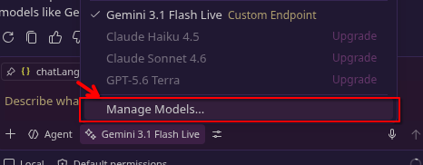
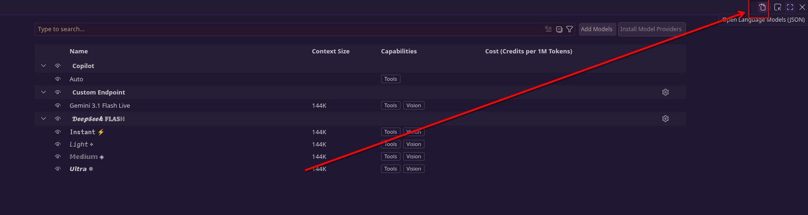
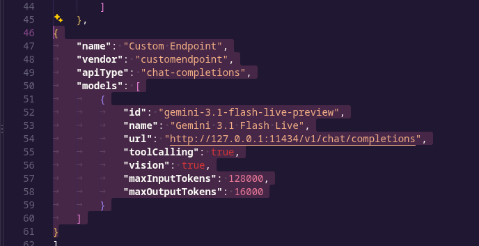
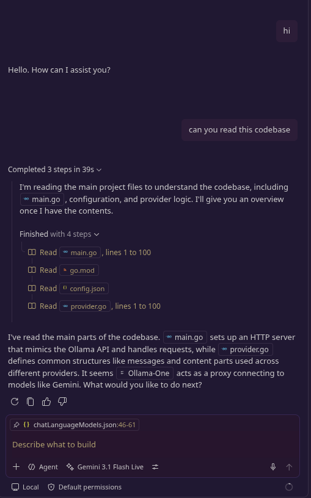
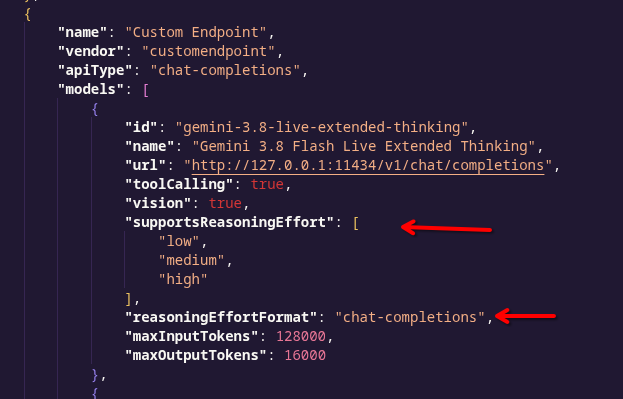

# Ollama-One

Ollama-One acts as a proxy connecting to models like Gemini, mimicking the Ollama API.

## Instalasi

### Prasyarat

Buat file `config.json` menggunakan `config.example.json` sebagai contoh.

### Jalankan Secara Lokal

Pastikan Go telah terinstal.

```bash
go build -o ollama-one .
./ollama-one
```

### Jalankan dengan Docker

```bash
docker compose up -d
```

## Setup

Follow these steps to configure Ollama-One:

| Step 1 | Step 2 | Step 3 |
|---|---|---|
|  |  |  |

## Chat Interface

Here is a preview of the chat interface:



## Konfigurasi VS Code

Untuk VS Code Copilot atau custom endpoint yang kompatibel dengan OpenAI yang mendukung Extended Thinking, gunakan konfigurasi berikut:




```json
{
  "name": "Custom Endpoint",
  "vendor": "customendpoint",
  "apiType": "chat-completions",
  "models": [
    {
      "id": "gemini-3.8-live-extended-thinking",
      "name": "Gemini 3.8 Flash Live Extended Thinking",
      "url": "http://127.0.0.1:11434/v1/chat/completions",
      "toolCalling": true,
      "vision": true,
      "supportsReasoningEffort": [
        "low",
        "medium",
        "high"
      ],
      "reasoningEffortFormat": "chat-completions",
      "maxInputTokens": 128000,
      "maxOutputTokens": 16000
    },
    {
      "id": "gemini-3.8-live",
      "name": "Gemini 3.8 Flash Live",
      "url": "http://127.0.0.1:11434/v1/chat/completions",
      "toolCalling": true,
      "vision": true,
      "maxInputTokens": 128000,
      "maxOutputTokens": 16000
    }
  ]
}
```

